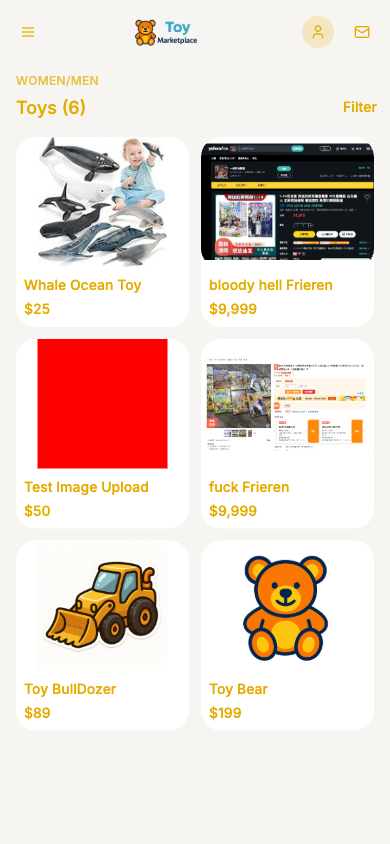

# Claude Code Toy Marketplace

This codebase was forked from [uopsdod/claude_code_toy_marketplace](https://github.com/uopsdod/claude_code_toy_marketplace.git). Many thanks to the author @uopsdod.

As teaching material for the Hiskio online course, I highly recommend this course for anyone who wants to start using Claude Code.

Check the course [page](https://hiskio.com/courses/2475?srsltid=AfmBOorPjCtGEH95wZbWu63HbikN5ayJCktSAtsg_Glk9-v0sh4q-hrZ)

---

## Demo: Theme Color Change + Browser Verification

### What We Tested

We wanted to verify that Claude Code can autonomously change a theme color, restart the dev server, open a real browser at a specific device viewport, visually confirm the result via screenshot, and close the browser — all from a single prompt.

### The Prompt

```
restart the webserver. use the Dimensions: iPhone 12 Pro (390 x 844)
the current theme color is blue, change it to yellow. go to the homepage, take a screenshot named
"homepage-yellow.png" to verify your change until you implement it correctly.
close the browser in the end.
```

### Hook Notification

The project has a **Notification hook** configured in `.claude/settings.json`. It fires whenever Claude Code needs your attention or finishes a long-running task. Instead of requiring you to watch the terminal, it runs a custom script that plays an MP3 sound effect — so you get an audio alert automatically.

The hook was triggered at the end of this session when Claude Code completed the task and sent a "task done" notification to the user.

### Result


